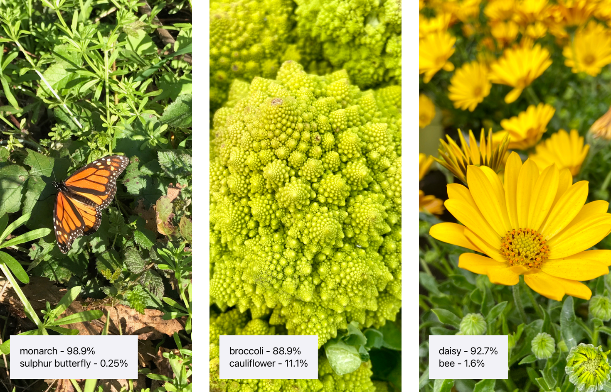

# Classifying Images with Vision and Core ML

Crop and scale photos using the Vision framework and classify them with a Core ML model.

## Overview
The app in this sample identifies the most prominent object in an image by using MobileNet,
an open source image classifier model that recognizes around 1,000 different categories.



Each time a user selects a photo from the library or takes a photo with a camera,
the app passes it to a [Vision][Vision] image classification request.
Vision resizes and crops the photo to meet the MobileNet model's constraints for its image input,
and then passes the photo to the model using the [Core ML][Core ML] framework behind the scenes.
Once the model generates a prediction, Vision relays it back to the app, which presents the results to the user.

[Vision]: https://developer.apple.com/documentation/vision
[Core ML]: https://developer.apple.com/documentation/coreml

The sample uses MobileNet as an example of how to use a third-party Core ML model.
You can download open source models --- including a newer version of MobileNet --- on the
[Core ML model gallery][Core ML model gallery].

[Core ML model gallery]: https://developer.apple.com/machine-learning/models

Before you integrate a third-party model to solve a problem
--- which may increase the size of your app --- consider using an API in the SDK.
For example, the [Vision][Vision] framework's [VNClassifyImageRequest][VNClassifyImageRequest] class offers the same
functionality as MobileNet, but with potentially better performance and without increasing the size of your app
(see [Classifying Images for Categorization and Search][Classifying Images for Categorization and Search]).

[Classifying Images for Categorization and Search]: https://developer.apple.com/documentation/vision/classifying_images_for_categorization_and_search
[VNClassifyImageRequest]: https://developer.apple.com/documentation/vision/vnclassifyimagerequest

- Note: You can make a custom image classifier that identifies your choice of object types with [Create ML][Create ML].
See [Creating an Image Classifier Model][Creating an Image Classifier Model]
to learn how to create a custom image classifier that can replace the MobileNet model in this sample.

[Create ML]: https://developer.apple.com/documentation/createml
[Creating an Image Classifier Model]: https://developer.apple.com/documentation/createml/creating_an_image_classifier_model

## Configure the Sample Code Project

The sample targets iOS 14 or later, but the MobileNet model in the project works with:

- iOS 11 or later
- macOS 10.13 or later

To take photos within the app, run the sample on a device with a camera.
Otherwise, you can select photos from the library in Simulator.

- Note: Add your own photos to the photo library in Simulator by dragging photos onto its window.

## Create an Image Classifier Instance

At launch, the [`ImagePredictor`][ImagePredictor] class creates an image classifier singleton by calling its
[`createImageClassifier()`][createImageClassifier] type method.

[ImagePredictor]: x-source-tag://ImagePredictor
[createImageClassifier]: x-source-tag://createImageClassifier

``` swift
/// - Tag: name
static func createImageClassifier() -> VNCoreMLModel {
    // Use a default model configuration.
    let defaultConfig = MLModelConfiguration()

    // Create an instance of the image classifier's wrapper class.
    let imageClassifierWrapper = try? MobileNet(configuration: defaultConfig)

    guard let imageClassifier = imageClassifierWrapper else {
        fatalError("App failed to create an image classifier model instance.")
    }

    // Get the underlying model instance.
    let imageClassifierModel = imageClassifier.model

    // Create a Vision instance using the image classifier's model instance.
    guard let imageClassifierVisionModel = try? VNCoreMLModel(for: imageClassifierModel) else {
        fatalError("App failed to create a `VNCoreMLModel` instance.")
    }

    return imageClassifierVisionModel
}
```

The method creates a Core ML model instance for Vision by:

1. Creating an instance of the model's wrapper class that Xcode auto-generates at compile time
2. Retrieving the wrapper class instance's underlying ['MLModel'][MLModel] property
3. Passing the model instance to a [`VNCoreMLModel`][VNCoreMLModel] initializer

[MLModel]: https://developer.apple.com/documentation/coreml/mlmodel
[VNCoreMLModel]: https://developer.apple.com/documentation/vision/vncoremlmodel

The Image Predictor class minimizes runtime by only creating a single instance
it shares across the app.

- Note: Share a single [`VNCoreMLModel`][VNCoreMLModel] instance for each Core ML model
in your project.

## Create an Image Classification Request

The Image Predictor class creates an image classification request ---
a [`VNCoreMLRequest`][VNCoreMLRequest] instance ---
by passing the shared image classifier model instance and a request handler to its initializer.

[VNCoreMLRequest]: https://developer.apple.com/documentation/vision/vncoremlrequest

``` swift
// Create an image classification request with an image classifier model.

let imageClassificationRequest = VNCoreMLRequest(model: ImagePredictor.imageClassifier,
                                                 completionHandler: visionRequestHandler)

imageClassificationRequest.imageCropAndScaleOption = .centerCrop
```

The method tells Vision how to adjust images that don't meet the model's image input constraints
by setting the request's [`imageCropAndScaleOption`][imageCropAndScaleOption] property to
[`centerCrop`][centerCrop].

[imageCropAndScaleOption]: https://developer.apple.com/documentation/vision/vncoremlrequest/2890144-imagecropandscaleoption
[centerCrop]: https://developer.apple.com/documentation/vision/vnimagecropandscaleoption/centercrop

## Create a Request Handler

The Image Predictor's [`makePredictions(for photo, ...)`][makePredictions] method creates a
[`VNImageRequestHandler`][VNImageRequestHandler]
for each image by passing the image and its orientation to the initializer.

[makePredictions]: x-source-tag://makePredictions
[VNImageRequestHandler]: https://developer.apple.com/documentation/vision/vnimagerequesthandler

``` swift
let handler = VNImageRequestHandler(cgImage: photoImage, orientation: orientation)
```

Vision rotates the image based on `orientation`
--- a [`CGImagePropertyOrientation`][CGImagePropertyOrientation] instance ---
before sending the image to the model.

[CGImagePropertyOrientation]: https://developer.apple.com/documentation/imageio/cgimagepropertyorientation

If the image you want to classify has a URL, create a Vision image request handler with one of these initializers:
* [`VNImageRequestHandler(url:options:)`][VNImageRequestHandler(url:options:)]
* [`VNImageRequestHandler(url:orientation:options:)`][VNImageRequestHandler(url:orientation:options:)]

[VNImageRequestHandler(url:options:)]: https://developer.apple.com/documentation/vision/vnimagerequesthandler/2866553-init
[VNImageRequestHandler(url:orientation:options:)]: https://developer.apple.com/documentation/vision/vnimagerequesthandler/2869645-init

## Start the Request
The [`makePredictions(for photo, ...)`][makePredictions] method starts the request by adding it into a
[`VNRequest`][VNRequest] array and passes it to the handler's [`perform(_:)`][VNImageRequestHandler.perform] method.

[VNRequest]: https://developer.apple.com/documentation/vision/vnrequest
[VNImageRequestHandler.perform]: https://developer.apple.com/documentation/vision/vnimagerequesthandler/2880297-perform

``` swift
let requests: [VNRequest] = [imageClassificationRequest]

// Start the image classification request.
try handler.perform(requests)
```

- Note: You can perform multiple Vision requests on the same image by adding each request to the array you pass
to the [`perform(_:)`][VNImageRequestHandler.perform] method's `requests` parameter.

## Retrieve the Request's Results

When the image classification request is finished, Vision notifies the Image Predictor
by calling the request's completion handler, [`visionRequestHandler(_:error:)`][visionRequestHandler].
The method retrieves the request's [`results`][VNRequest.results] by:

[visionRequestHandler]: x-source-tag://visionRequestHandler
[VNRequest.results]: https://developer.apple.com/documentation/vision/vnrequest/2867238-results

1. Checking the `error` parameter
2. Casting [`results`][VNRequest.results]
to a [`VNClassificationObservation`][VNClassificationObservation] array

[VNClassificationObservation]: https://developer.apple.com/documentation/vision/vnclassificationobservation

``` swift
// Cast the request's results as an `VNClassificationObservation` array.
guard let observations = request.results as? [VNClassificationObservation] else {
    // Image classifiers, like MobileNet, only produce classification observations.
    // However, other Core ML model types can produce other observations.
    // For example, a style transfer model produces `VNPixelBufferObservation` instances.
    print("VNRequest produced the wrong result type: \(type(of: request.results)).")
    return
}

// Create a prediction array from the observations.
predictions = observations.map { observation in
    // Convert each observation into an `ImagePredictor.Prediction` instance.
    Prediction(classification: observation.identifier,
               confidencePercentage: observation.confidencePercentageString)
}
```

The Image Predictor converts each result to [`Prediction`][Prediction] instances,
a simple structure with two string properties.

[Prediction]: x-source-tag://Prediction

The method sends the `predictions` array to the Image Predictor's client --- the main view controller ---
by calling the client's completion handler.

``` swift
// Send the predictions back to the client.
predictionHandler(predictions)
```

## Format and Present the Predictions

The main view controller's [`imagePredictionHandler(_:)`][imagePredictionHandler] method formats the
individual predictions into a single string and updates a label in the app's UI using helper methods.

[imagePredictionHandler]: x-source-tag://imagePredictionHandler

``` swift
private func imagePredictionHandler(_ predictions: [ImagePredictor.Prediction]?) {
    guard let predictions = predictions else {
        updatePredictionLabel("No predictions. (Check console log.)")
        return
    }

    let formattedPredictions = formatPredictions(predictions)

    let predictionString = formattedPredictions.joined(separator: "\n")
    updatePredictionLabel(predictionString)
}
```

The [`updatePredictionLabel(_:)`][updatePredictionLabel] helper method safely updates the UI by updating
the label's text on the main dispatch queue.

[updatePredictionLabel]: x-source-tag://updatePredictionLabel

``` swift
func updatePredictionLabel(_ message: String) {
    DispatchQueue.main.async {
        self.predictionLabel.text = message
    }
```

- Important: Keep your app's UI responsive by making predictions with Core ML models off of the main thread.
